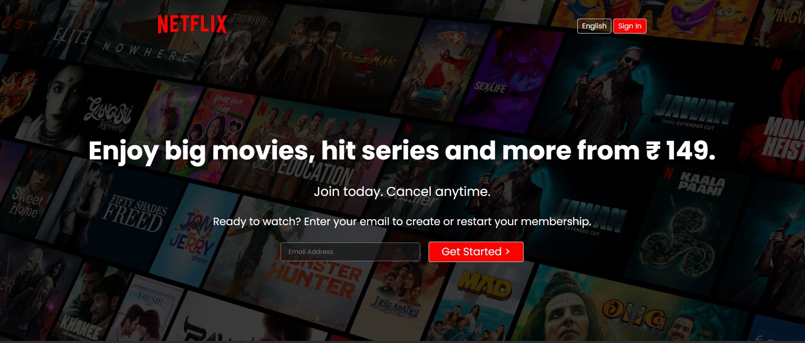

# 🎬 Netflix Clone (HTML + CSS)

A responsive front-end replica of the Netflix landing page, built using pure HTML and CSS. This project aims to mimic the visual design and layout of Netflix's home interface with pixel-perfect precision.

---

## 📌 Features

- Static homepage design inspired by Netflix
- Responsive layout using media queries
- Hover effects for interactive UI components
- Clean and modular CSS styling
- Optimized image usage and performance tweaks

---

## 🛠️ Technologies Used

- **HTML5**
- **CSS3**
- **Google Fonts** (optional for font styling)
- **Font Awesome** (optional for icons)

---

## 🖼️ Preview




## 🚀 Getting Started

To run this project locally:

```bash
git clone https://github.com/gayatrishelke2004/NetflixClone.git
cd NetflixClone
# Open index.html in your browser
```

---

## 📂 Folder Structure

```plaintext
netflix-clone/
├── index.html
├── style.css
├── images
|___videos
│   └── (assets used in the design)
```

---

## 📣 Credits

- Design inspired by [Netflix.com](https://www.netflix.com)
- Icons from [Font Awesome](https://fontawesome.com)
- Fonts from [Google Fonts](https://fonts.google.com)

---

## 🎯 Future Scope

- Add JavaScript for dynamic features (video cards, sign-in form)
- Convert into a full-stack streaming prototype using React or MERN stack

---

